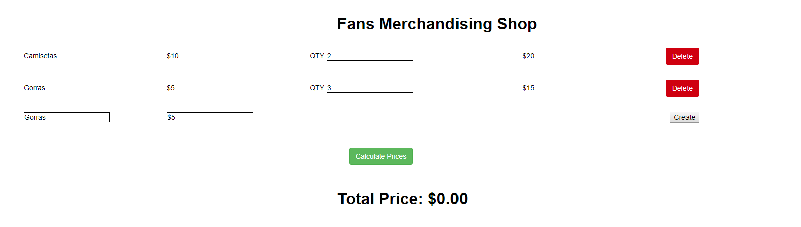

# DOM | The Shopping Cart

## Introducción

Crearemos un carrito de la compra, donde los usuarios podrán añadir o quitar productos del carrito. Además, podrán calcular el precio total de los ítems por cada producto así como el precio total del carrito.

## Ejercicio

## Requerimientos

- Usaremos un normalizador para evitar diferencias entre estilos de navegadores. Su CDN es:
	https://cdnjs.cloudflare.com/ajax/libs/normalize/5.0.0/normalize.min.cs

- Usa al menos tres eventos `onclick`
- Usa al menos un `getElementById`
- Usa al menos una vez `getElementsByTagName`
- Usa al menos una vez `getElementsByClassName`

## Entregables
Escribe el código JavasScript organizado en los ficheros disponibles y súbelo al repositorio para después hacer pull-request.

### Iteración 1: Crear un producto
Empezaremos creando el HTML para los productos. Debería parecerse a esto:

Cada producto tendrá:

- Un div con un span, mostrando el nombre del producto
- Un div con un span, mostrando el coste de una unidad
- Un div con un label y un input, donde el usuario indicará cuantas unidades comprará
- Un div con un span, mostrando el precio total de todos los ítems. Este será el resultado de calcular el número de ítems multiplicado por el precio de un producto. El valor por defecto del precio total es 0
- Un div con un botón delete, para eliminar un producto de la lista
  
#### Calcula el precio total

Una vez que hayas preparado el HTML y el CSS (usa SASS para los estilos), usa JavaScript para obtener los datos necesarios para calcular el precio total y cambiar el valor del DOM.

- Crea un evento click para el botón  `Calculate Prices` 
- Este evento ejecutará una función que:
	* Recupera el precio unitario del producto
	* Recupera la cantidad de ítems deseados
	* Calcula el precio total según los datos anteriores
	* Actualiza el precio total del DOM

### Iteración 2: Añadir otro producto

Añade otro producto

Cuando cliquees en el botón `Calculate Prices`, todos los precios se deberían actualizar al mismo tiempo.

### Iteración 3: Calcula el precio total

Tendrás que sumar los precios totales de cada producto para calcular el valor total del carrito. Después se mostrará en el DOM.

Crea un nuevo `div` por debajo del botón `Calculate Prices`. Este  elemento `div` tendrá un título `h2` que mostrará:

`<h2>Total Price: 0€</h2>`

También has de crear una función que:

- Seleccione los totales de cada producto
- Sume todos los elementos seleccionados en el paso anterior y calcule el precio total
- Muestre el precio total en el DOM

### Iteration 4: Borrar un producto

Crearemos un evento click asociado a botones Delete para borrar un producto de la lista. Para hacer eso:
- Selecciona todos los botones `Delete` 
- Asígnales un evento click a cada uno con la siguiente funcionalidad:
	- Selecciona el div que contiene el elemento HTML del producto que queremos borrar
	- Selecciona el div que contiene la lista de productos 
	- Utiliza la función `removeChild` 
  
:bulb: Es posible trazar que botón se ha clicado mediante la función `e.currentTarget`. Además, selecciona el nodo del elemento padre con `parentNode`.

### Iteración 5: Crear nuevos productos 

Crearemos dinámicamente los nuevos productos de la tienda. El formulario debería parecerse a esto:

Aquí tendremos dos inputs que representen el nombre y el precio por unidad del nuevo producto. Al final, añadiremos un botón para crear el producto.

- Crea dos input que permitan al usuario añadir los datos del nuevo producto.
- Crea un botón. Este botón tendrá asignado un evento click con la siguiente funcionalidad:
	- Recoger los datos de los inputs.
	- Crear una nueva fila con los los datos del producto almacenado.

:warning: Asegúrate que el nuevo producto tenga el mismo comportamiento de los ya existentes.
- Deberías ser capaz de calcular el precio total del producto
- Se debería actualizar el valor total del carrito con el precio total del producto añadido
- El producto debería poder borrarse

# Gestión del stock

Se quiere controlar el stock de productos de nuestro e-commerce. De momento, es una tienda pequeña y sólo tienen veinte productos, pero se venden mucho. Por eso tenemos que controlar el stock de cada uno de ellos para que siempre los tengamos disponibles. Partiremos de un array de productos que leeremos al cargar la página index.html y actualizaremos siempre que haya cambios en el stock.

**Pasos previos**

1. Renombra tu index.html como carrito.html.
2. Renombra tu script.js como carrito.js
3. Trabaja las nuevas funcionalidades en index.html y script.js

## Listado del stock

### Ver stock
- Implementar una función `listStock()` que tendrá que:
  - recorrer el array de productos.
  - muestra por pantalla una lista con los campos: id, nombre producto, categoría y núm de unidades  
- Esta función se asociará al evento onload de la página.

### Generar Stock
Implementar una función `demandProduct()` que se utilizará para pedir productos nuevos. La función tendrá que: 
   - Recibir como parámetro un producto y el número de productos.
   - Si el número de producto no se informa se generará aleatoriamente la cantidad.
   - Se devuelve un objeto con la nueva cantidad.

### Ampliar Stock
   - Se creará una función `loadStock()` que incorporará el producto generado con la función anterior al array de productos.
   - Recibe como parámetro el objeto y lo incorpora al array comprobando que exista para sustituir al objeto existente.

## Ranking con los productos más vendidos

En este apartado queremos añadir unas cuántas funcionalidades adicionales para hacer la tienda más interactiva. La idea es que se puedan comprar y vender productos y poder tener un ranking ordenado de los productos más vendidos.

En concreto, las funcionalidades que queremos tener son:

**Funcionalidades del vendedor**

- Añadir 1 producto: añadir sólo un producto en el catálogo de productos disponibles a la venta. Este producto tendrá un número de stock aleatorio.
- Eliminar 1 producto: eliminar el último producto añadido en el catálogo de productos. Elimina todo el stock disponible del producto.
Ordenar los productos según el stock que queda: ordena los productos según su stock. El número de producto asociado a el stock puede cambiar.

**Funcionalidades del comprador**

- Comprar un producto: el comprador puede comprar un producto de los disponibles en el catálogo de productos. Cada vez que se compra un producto se reordena y se visualiza el ranking de productos más vendidos.

### Añadir un producto
Implementar una función `addProduct()` para añadir un nuevo producto al catálogo de productos. Tendrá que tener en cuenta:

- Obtener los datos de nombre, categoría y cantidad del producto y generar un nuevo valor de índex secuencial al último producto de la lista.
- Devolver el producto creado.
- Invocar la función `loadStock()` para incorporar el producto al array.
- Invocar la función `listStock()` para listar el prodcuto incorporado.

### Eliminar un producto
Eliminar un producto mediante una función deleteProduct() que:
- Recibirá por parámetro el índice del producto a eliminar.
- Eliminará del array de productos el objeto.

### Ordenar productos según el stock
La función `orderProduct()` debe permitir ordenar los productos según el stock que tienen. Los productos con poco stock serán los primeros. La función deberá:
- Ordenar el array de productos por el campo quantity en orden ascendente.
- Invocar la función verStock() para actualizar el listado

### Comprar un producto
La funcionalidad comprar producto es indispensable si queremos hacer un ranking de los productos más vendidos. La funcionalidad que se quiere implementar es que el comprador informe sobre el producto deseado y que decrezca el número de stock del producto. En este caso, el comprador tiene que decir el número de producto que quiere comprar.
Crear una función `buyProduct()` que tiene que:
- Recibir un id de producto como argumento.
- Comprobar que el parámetro de la función corresponde a un número de producto válido.
- Comprobar que el stock del producto sea mayor que la cantidad a comprar
- Si el stock es positivo se resta de la cantidad de stock las unidades a comprar y se añade el producto al array de productos del carrito.
- Si el stock del producto es < 1, en este caso el stock no varía y el producto no consta en el array de productos vendidos.

En cualquier caso, se muestra el ranking y se actualiza el listado de productos por pantalla.

### Mostrar el ranking de los productos más vendidos
La función que calcula el ranking de los productos más vendidos se basa en un array donde hay almacenados los productos que ha comprado el usuario. Este array se va llenando a medida que el usuario utiliza la función `buyProduct()`.

## Funcionalidades adicionales
Concretamente se quiere:

- Comprobar si todos los productos tienen más de 10 unidades de stocks.
- Comprobar si algún producto tiene 0 unidades de stock.
- Saber qué productos tienen 0 unidades de stock.
- Un listado del stock desde el producto X al producto Y.
  
